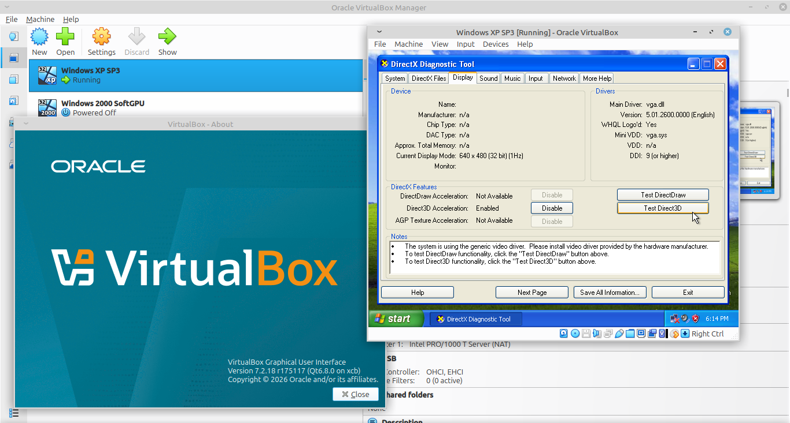
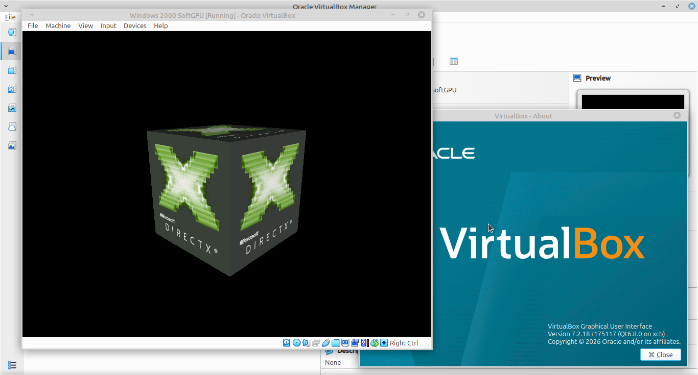

# SoftGPU Installer for Windows XP/2000
A very simple installation script for **SoftGPU's software renderer**, to use in Windows 2000, Windows XP 32-Bit and Windows Server 2003 32-Bit.

This is mostly just an experiment and it's also very buggy, but it DOES work :)




This is all JHRobotic's work on SoftGPU for Windows 9x, this silly installer script was all I did. The binaries are pulled from these repos:
 - VMDisp9x for 9x: https://github.com/JHRobotics/vmdisp9x
 - Mesa3D for 9x: https://github.com/JHRobotics/mesa9x
 - WineD3D for 9x: https://github.com/JHRobotics/wine9x 

## Current Issues
 - OpenGlide not included, I couldn't get it to work :/
 - No support for 64-Bit Windows (this might require rebuilding the DLLs)
 - No true 3D acceleration on VirtualBox (or any VM software for that matter), just slow software rendering.
 - DirectX Diagnostic Tool works only with Direct3D 8 and 9 (The Direct3D 7 test does work with dxdiag, but Wine's ddraw.dll causes a crash after Direct3D 7 test and thus it has been disabled for this specific application).
 - The OpenGL screensavers in Windows 2000 are broken :(

## Requirements
 - Intel Core 2 CPU or newer
 - Video driver with 16-Bit color depth or higher. On VirtualBox, install the Guest Addtions or in VMWare install the correct version of VMWare Tools. If you are on real hardware but you are stuck in 16 color mode, you can try [Bearwindow's VBEMP Video Driver](https://archive.org/details/VBEMPNT).
 - As much RAM as possible (512 MB minimum, the more the better)

## Installation
 - Check that your systems meets the requirements (see above)
 - Head over to [releases](https://github.com/KernelKommando/SoftGPU-NT5/releases) and get either the ISO or ZIP archive.
 - You can then mount the ISO in whatever VM software you use, and the installer will show up. If not then just run the **Install.vbs** file. 
 - If you've got the ZIP file instead, make sure to extract both `Install.vbs` and the `Files` directory. Be sure both remain together before running **Install.vbs**

## Building the ZIP/ISO archives
You'll need a Linux system or WSL on Windows to run the `CreateArchive.sh` script. Of course you should also clone the repo with git.

Then you need to ensure that the following binaries are installed in your system: **sha1sum sha256sum sha512sum curl 7za unix2dos gcab**

On Ubuntu you can do:

```
sudo apt install curl 7zip dos2unix gcab
```

Then to run `CreateArchive.sh`

```
chmod +x CreateArchive.sh
./CreateArchive.sh
```
